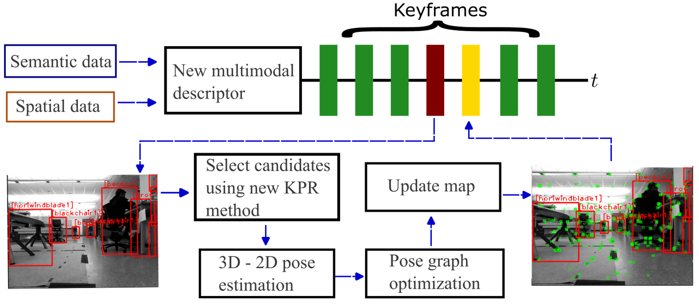

 robotic systems.")

Mobile robots operating in GPS-denied environments require reliable localization, navigation, and spatial understanding to operate autonomously. Our research develops novel semantic mapping and localization approaches for single- and multi-agent robotic systems, with an emphasis on collaborative mapping, shared spatial representations, and robust navigation in complex and dynamic environments. Applications include collaborative finishing operations for large-scale manufacturing, where multiple mobile robots coordinate to perform tasks over large workspaces, as well as autonomous navigation and operation in hazardous or dangerous environments where human access is limited.

These projects have been funded by the National Science Foundation and Battelle Energy Alliance (Idaho National Lab)