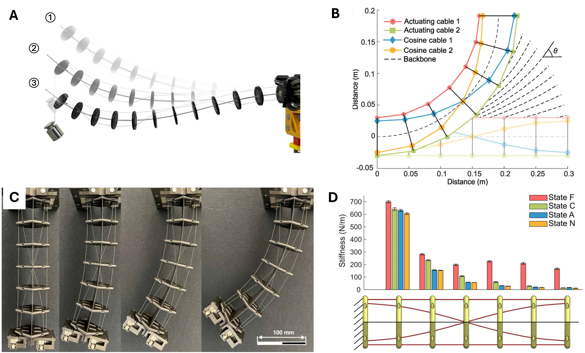
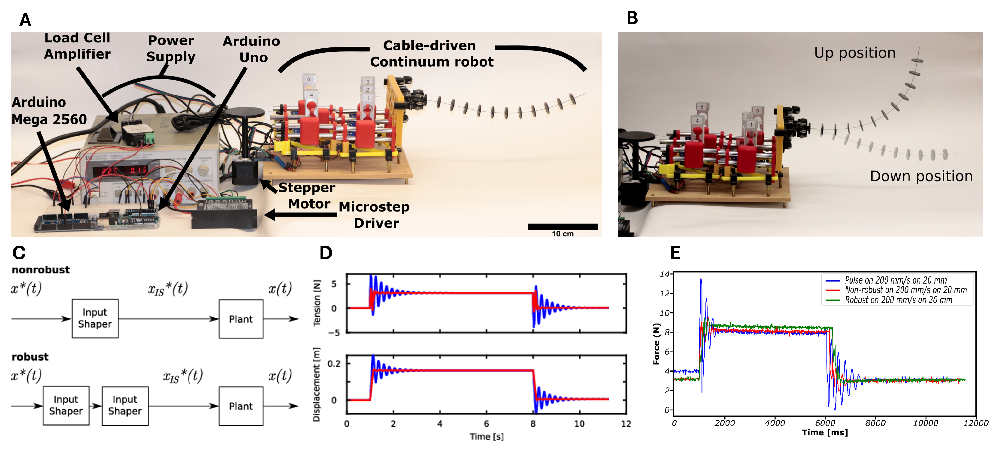

Continuum robots are not like traditional robotic arms, humanoids, or most other robots that have rigid, load-bearing skeletons. Instead, they bend or flex in order to move, and they typically feel softer than rigid robots when they bump into other things.  

## Key Questions

- How should these robots be designed to ensure reliable task performance?
- Which modeling approaches are effective for understanding static and dynamic behaviors?
- What are the relationships between design and control and robotic capabilities like manipulation and locomotion?

## Selected Research Outcomes

### Cable-based Stiffening

Continuum robots are underactuated, and their shape depends not only on the tendons that pull on them but also on the forces applied to the robot's body. While this is sometimes a good property to have, a lack of control over the shape can also be problematic. We found that cables can be added to the structure to stiffen it without compromising the ability to move with actuation; in other words, cables can add stiffness to external loads without adding stiffness that must be overcome by the actuating cables. 

### Vibration-Reducing Control

Another consequence of underacutation is that dynamic motions tend to produce vibration in the structure. Input shaping is one way of tuning the input to a system so that it does not excite vibrational modes. However, the standard theory applies only to linear systems. We have shown that an input shaper based on a linear system model of a continuum robot can be very effective at preventing vibrations, even with fast motion commands and for large bending angles of the robot. 

## References

Molaei, Parsa, Nekita A. Pitts, Genevieve Palardy, et al. “Cable Decoupling and Cable-Based Stiffening of Continuum Robots.” IEEE Access 10 (2022): 104852–62. https://doi.org/10.1109/ACCESS.2022.3210120.

Molaei, Parsa, Terrilyn A. Legier, and Hunter B. Gilbert. “A Continuously Variable Stiffness Mechanism for Tendon-Driven Robots Using Decoupled Stiffening Cables and Hertzian Contact Mechanics.” Volume 7: 48th Mechanisms and Robotics Conference (MR), August 25, 2024, V007T07A048. https://doi.org/10.1115/DETC2024-143916.

Hernandez Ibarra, Rodolfo, Karan Baker, Parsa Molaei, Adrian Stein, and Hunter B. Gilbert. “Input Shaping for Point-to-Point Motion with a Continuum Robot Arm.” 2026 American Control Conference, 2026, Presented.

## Acknowledgements
These projects have been funded in part by the Louisiana Space Grant Consortium (LaSPACE) and the National Science Foundation under award number 2133019.